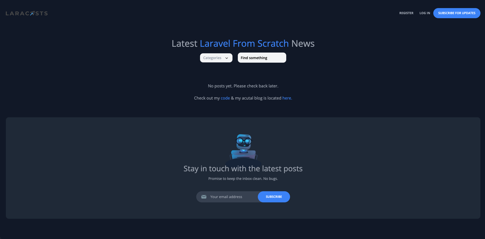

# Laravel DevOps Demo Project


Cloned from original [Laravel from Scratch codebase](https://github.com/JeffreyWay/Laravel-From-Scratch-Blog-Project) by Jeffrey Way

Here's the tutorial he released [Laravel from Scratch](http://laravelfromscratch.com)

I added darkmode via [Tailwindcss](https://tailwindcss.com/)

Click [here](https://www.laravel-blog.terencehamilton.com/) to see my website or click the image below.👇🏾

[](https://www.laravel-blog.terencehamilton.com/)

## Installation

First clone this repository, switch to the darkmode branch, install the dependencies, and setup your .env file.

```
git clone git@github.com:HamiltonMultimedia/Laravel-Blog.git blog
git checkout darkmode
composer install
cp .env.example .env
```

Or clone [the original Laravel from Scratch](http://laravelfromscratch.com) repository, install the dependencies, and setup your .env file.

```
git clone git@github.com:JeffreyWay/Laravel-From-Scratch-Blog-Project.git blog
composer install
cp .env.example .env
```

Then create the necessary database.

```
php artisan db
create database blog
```

And run the initial migrations and seeders.

```
php artisan migrate --seed
```

## Further Ideas

Of course we only had time in the Laravel From Scratch series to review the essentials of a blogging platform. You can certainly take this many 
steps further. Here are some quick ideas that you might play with.

1. Add a `status` column to the posts table to allow for posts that are still in a "draft" state. Only when this status is changed to "published" should they show up in the blog feed. 
2. Update the "Edit Post" page in the admin section to allow for changing the author of a post.
3. Add an RSS feed that lists all posts in chronological order.
4. Record/Track and display the "views_count" for each post.
5. Allow registered users to "follow" certain authors. When they publish a new post, an email should be delivered to all followers.
6. Allow registered users to "bookmark" certain posts that they enjoyed. Then display their bookmarks in a corresponding settings page.
7. Add an account page to update your username and upload an avatar for your profile.


--
# License.

Copyright (c) 2023, [Terence Hamilton](https://terencehamilton.com)

Permission to use, copy, modify, and/or distribute this software for any purpose with or without fee is hereby granted, provided that the above copyright notice and this permission notice appear in all copies.

THE SOFTWARE IS PROVIDED "AS IS" AND THE AUTHOR DISCLAIMS ALL WARRANTIES WITH REGARD TO THIS SOFTWARE INCLUDING ALL IMPLIED WARRANTIES OF MERCHANTABILITY AND FITNESS. IN NO EVENT SHALL THE AUTHOR BE LIABLE FOR ANY SPECIAL, DIRECT, INDIRECT, OR CONSEQUENTIAL DAMAGES OR ANY DAMAGES WHATSOEVER RESULTING FROM LOSS OF USE, DATA OR PROFITS, WHETHER IN AN ACTION OF CONTRACT, NEGLIGENCE OR OTHER TORTIOUS ACTION, ARISING OUT OF OR IN CONNECTION WITH THE USE OR PERFORMANCE OF THIS SOFTWARE.